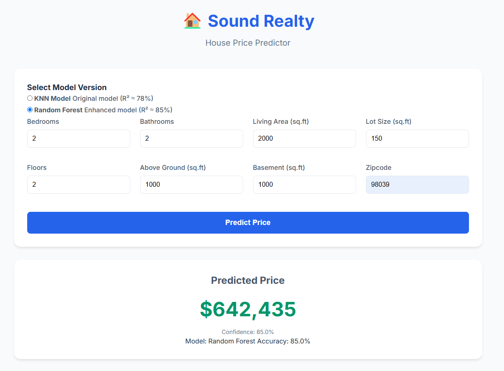

# Sound Realty House Price Predictor

A machine learning-powered application that helps predict house prices in the Seattle area, combining property features with demographic data for accurate estimations.

## Project Overview

This project implements a house price prediction service for Sound Realty, featuring:
- A machine learning model trained on Seattle area housing data
- A REST API for serving predictions
- A user-friendly web interface for realtors
- Integration of demographic data for better predictions



The user interface is designed to provide realtors with an intuitive and efficient way to input property details and receive instant price predictions. This enhances their ability to make data-driven decisions quickly, ultimately improving client interactions and increasing their competitive edge in the market.

## Key Features

- **Multiple Models**:
  - KNN Model (R² ≈ 78%)
  - Random Forest Model (R² ≈ 80%- 87%)
  - Model selection in UI
  
- **Smart Predictions**:
  - Comprehensive feature set
  - Demographic data integration
  - Confidence scores
  - Real-time validation

- **User Experience**:
  - Clean, modern interface
  - Instant feedback
  - Detailed results
  - Error handling

## Technical Stack

- **Backend**:
  - FastAPI (Python web framework)
  - scikit-learn (Machine Learning)
  - Pandas (Data Processing)
  - Pydantic (Data Validation)

- **Frontend**:
  - HTML5/CSS3/JavaScript
  - Modern responsive design
  - Real-time validation

- **Infrastructure**:
  - Docker & Docker Compose
  - Nginx (Web Server)
  - REST API architecture

## Project Structure

```